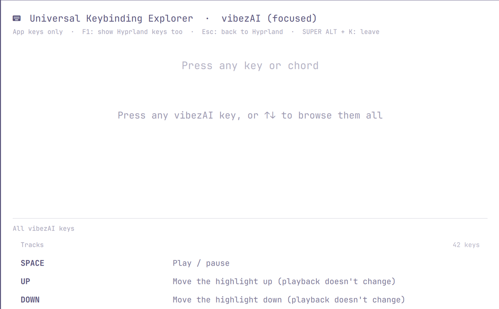

# Universal Keybinding Explorer for Omarchy

**Universal** means it explains every key you can press: your Hyprland / [Omarchy](https://omarchy.org) bindings,
**and** each app's own keys and `:` commands, for any app that has a small keymap file. Press SUPER + ALT + K, then
press any key or chord to see what it does. It only explains; nothing is run, and no key is sent to any app.



It's an Omarchy shell plugin (an overlay), so it works only on Omarchy, with its Quickshell-based shell and
Hyprland's Lua config.

## What it does

- **Learn mode.** SUPER + ALT + K switches Hyprland to a submap where only Escape and SUPER + ALT + K are bound, so
  every other key reaches the overlay instead of firing its action.
- **Chords.** Held modifiers pop up as keycaps, always in the order SUPER, CTRL, SHIFT, ALT. The bindings that use
  them are listed, and completing a chord shows what it does, with up to four "same key, other modifiers" examples.
  The descriptions are the ones in Omarchy's SUPER + K list (`omarchy-menu-keybindings --print`), re-read on every
  open, so your own edits to `bindings.lua` show up straight away.
- **Bare keys and browsing.** A bare key lists every binding on it. ↑ ↓, PgUp, PgDn or the mouse wheel walk the list,
  previewing each row up top.
- **Typing searches.** Letters typed quickly (≤ 400 ms apart) build a word that searches every binding's keys and
  description. Modifier words match in any order and with aliases ("win shift f", "super+shift+return",
  "control mod return"). Pressing CTRL, ALT or SUPER drops the word and goes back to chords.
- **Apps.** A word that fits an app's name (e.g. "vibez") lists an **App** row first, above the Hyprland bindings
  that launch it. Enter opens that app's keys. SUPER + ALT + K always opens at the top level (all your keys); SUPER + ALT + CTRL + K
  opens straight in the focused window's app when a keymap matches it, and at the top level otherwise.
  - **App keys only** (the default view): only the app's keys are listed and matched. An app key that Hyprland binds too
    is marked "⚠ taken by Hyprland (…)", because Hyprland grabs it first and the app never receives it.
  - **F1** switches to **app + Hyprland keys**: Hyprland's bindings come back, shown as "Hyprland: …".
  - **`:`** lists the app's `:` commands with their arguments, what they do, and where in the app they work. The letters
    after it filter the list (`:ef` → `:effort`; when no name fits, descriptions are searched: `:bitrate` → `:quality`).
  - **Esc** or **Backspace** goes back to the Hyprland keys. **SUPER + ALT + K** leaves.

Included apps, each generated from its source:

- **[vibezAI](https://github.com/angusforbes/vibezAI)** (a terminal Apple Music player): 78 keys and 9 `:` commands.
- **[hyprpi](https://github.com/angusforbes/hyprpi)'s four panels**: agents, Stream, projects and Thoughts. Each has
  its own keys and `/` commands, plus the message box they all share.

## Install

Requirements: Omarchy (omarchy-shell, Hyprland with the Lua config), `jq`, and `node` if you want to regenerate keymaps.

1. Put the plugin where Omarchy looks for plugins and enable it:

   `git clone https://github.com/angusforbes/omarchy-universal-keybinding-explorer ~/.config/omarchy/plugins/angusforbes.universal-keybinding-explorer`

   Add `{"id": "angusforbes.universal-keybinding-explorer"}` to the `plugins` list in `~/.config/omarchy/shell.json`,
   then run `omarchy-restart-shell`. (A symlink from that folder to a clone elsewhere works too. Don't leave a second
   copy, such as a backup, inside `~/.config/omarchy/plugins/`: a copy with the same `id` shadows the real one.)

2. Put the switch script on your PATH:

   `ln -s ~/.config/omarchy/plugins/angusforbes.universal-keybinding-explorer/bin/keybinding-explorer ~/.local/bin/keybinding-explorer`

3. Add the binding and the submap from [`hypr/bindings.lua`](hypr/bindings.lua) to `~/.config/hypr/bindings.lua`.
   Hyprland reloads by itself; `hyprctl configerrors` should print nothing.

Press SUPER + ALT + K (top level), or SUPER + ALT + CTRL + K (the focused app's keys, if it has a keymap). Esc or either chord leaves.

## App keymaps

Each app is one JSON file in [`keymaps/`](keymaps). The overlay reads them all on every open, so adding an app is
adding a file, with no code change and no restart.

```json
{
  "format": "keybinding-explorer-keymap/1",
  "id": "vibezai",
  "app": "vibezAI",
  "about": "Apple Music in the terminal",
  "match": ["vibez", "vibezai", "apple music", "music"],
  "focus": { "class": ["^org\\.omarchy\\.vibez$"], "title": ["^vibez(AI)?$"] },
  "bindings": [
    { "mods": "CTRL", "key": "SLASH", "section": "Search",
      "desc": "Cycle the source: AM → AI → AJ → SV → FE → AM",
      "src": ["internal/tui/model.go:1246"] }
  ],
  "commands": [
    { "cmd": "quality", "args": "<high|standard|256|64>", "desc": "Set Apple Music AAC bitrate",
      "where": "Anywhere but About", "src": ["internal/tui/model.go:1498", "internal/tui/model.go:1616"] }
  ]
}
```

| Field | Meaning |
|---|---|
| `id`, `app` | A short id, and the name shown in the header and on the App row |
| `about` | One line shown on the App row |
| `match` | Words that find the app when typed. Every typed word must appear in `app`, `id` or one of these. |
| `focus` | Focused-window rule: SUPER + ALT + CTRL + K starts in this app when the focused window's `class` **or** `title` matches any of these regexes (case-insensitive). See `hyprctl activewindow` for a window's class and title. |
| `bindings[].mods` | Any of `SUPER CTRL SHIFT ALT` (any order; aliases like `CONTROL` and `WIN` work), or `""` for a bare key |
| `bindings[].key` | The explorer's key name: `A`…`Z`, `0`…`9`, `F1`…, `SLASH` `APOSTROPHE` `SEMICOLON` `COMMA` `PERIOD` `MINUS` `EQUAL` `GRAVE` `BRACKETLEFT` `BRACKETRIGHT` `BACKSLASH`, `UP` `DOWN` `LEFT` `RIGHT` `RETURN` `TAB` `SPACE` `ESCAPE` `DELETE` `BACKSPACE` `HOME` `END` `PRIOR` (PgUp) `NEXT` (PgDn). A shifted character is SHIFT + its key: `?` is `SHIFT` + `SLASH`, `:` is `SHIFT` + `SEMICOLON`, capital `D` is `SHIFT` + `D`. |
| `bindings[].section` | Groups the app's list (e.g. "Tracks", "Search") and prefixes the description |
| `bindings[].desc` | What the key does, short enough for two lines |
| `commands[]` | Optional typed commands: `cmd`, `args`, `desc`, optional `aliases`, and `where` (the views or parts of the app it works in) |
| `prefix` | The key that opens the commands list and starts each command (default `:`; the hyprpi panels use `/`) |
| `include` | Ids of shared keymaps whose keys and commands this app also has. The app's own entry wins when both have the same chord, or a command of the same name. |
| `shared` | `true` for a keymap that only exists to be included (no `app`; it's never listed on its own). Example: `keymaps/hyprpi-shared.json`, the message box every hyprpi panel uses. |
| `src`, `more`, … | For people and generators (where in the app's source a key is handled, the full text); the explorer ignores them |

**Keep keymaps honest.** A keymap is best generated from the app's own source, so it can't drift.
[`keymaps/gen-vibezai.mjs`](keymaps/gen-vibezai.mjs) shows the pattern:

- descriptions come from vibezAI's README key tables, plus a short list for keys the README leaves out;
- every key must be found in a Go key handler (`case "ctrl+/"`), and its `src` records each file:line;
- a documented key the code doesn't handle is dropped and reported, and so is a command with no dispatch case;
- `:` commands come from the app's own command list.

Run it with `node keymaps/gen-vibezai.mjs <path to a vibezAI checkout>` after the app's keys change.
[`keymaps/gen-hyprpi.mjs`](keymaps/gen-hyprpi.mjs) does the same for hyprpi's panels:
`node keymaps/gen-hyprpi.mjs <path to a hyprpi checkout>`. Those panels read raw terminal input, so each key is
written as the escape sequence its handler compares against (`"\x1b[1;5A"`), and the generator decodes it into the
explorer's chord (CTRL + UP).

## Adding an app with an agent

[`skills/add-app-keymap/SKILL.md`](skills/add-app-keymap/SKILL.md) is a skill file for coding agents (Pi, Claude Code
and others that read `SKILL.md` skills). It walks an agent through adding an app: find where the app handles keys
and `:` / `/` commands, write `keymaps/<app>.json` with `src` references and a `focus` rule (ideally from a small
generator script), then test it with dry runs that never open the overlay. To install it for Pi:

`ln -s ~/.config/omarchy/plugins/angusforbes.universal-keybinding-explorer/skills/add-app-keymap ~/.pi/agent/skills/add-app-keymap`

## Testing without opening the overlay

A **dry run** builds the overlay's state without showing a window and logs one JSON line:

`omarchy-shell shell summon angusforbes.universal-keybinding-explorer '{"dry":true,"word":"vibez","enter":true,"then":[{"mods":["CTRL"],"key":"SLASH"}]}'`

`qs -p /usr/share/omarchy/shell log | grep keybinding-explorer-dry | tail -1`

All the payload keys are listed in [docs/DEVELOPING.md](docs/DEVELOPING.md).

## Credits

Written by Angus Forbes with AI coding agents. It is built on
[Omarchy](https://omarchy.org)'s shell, whose menu colours and style tokens it reuses so it looks native, and on
Hyprland's submaps. vibezAI is a fork of Simone Pelosi's [vibez](https://github.com/simonepelosi/vibez).

## License

[MIT](LICENSE)
